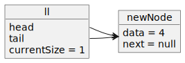

# Adding the First Node

    
 PlantUML Object Diagram Source 

    
 PlantUML Object Diagram Source 

    
 PlantUML Object Diagram Source 

    
 PlantUML Object Diagram Source 

# Adding the Second Node

    
 PlantUML Object Diagram Source 

    
 PlantUML Object Diagram Source 

    
 PlantUML Object Diagram Source 

    
 PlantUML Object Diagram Source 

    
 PlantUML Object Diagram Source 

# Adding the Third Node

    
 PlantUML Object Diagram Source 

    
 PlantUML Object Diagram Source 

    
 PlantUML Object Diagram Source 

    
 PlantUML Object Diagram Source 

