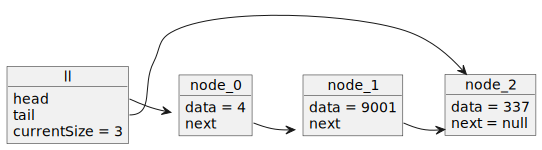
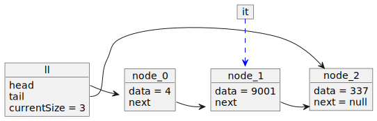

# Basic Traversal Loop

    
 PlantUML Object Diagram Source 

    
 PlantUML Object Diagram Source 

    
 PlantUML Object Diagram Source 

    
 PlantUML Object Diagram Source 

    
 PlantUML Object Diagram Source 

